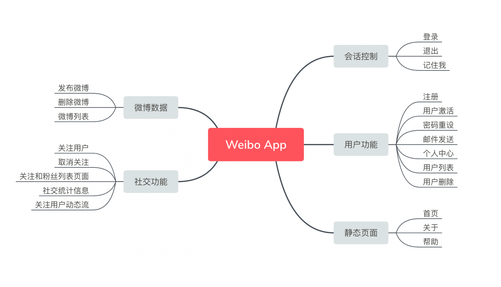

# Weibo

## 项目简介


使用laravel框架完成用户注册登录、个人信息修改、发布微博、关注用户以及查看微博动态
## 功能思维导图


  


## 安全性

###  CSRF（跨站请求伪造）
使用 POST 方法提交表单时，Laravel 为了安全考虑，会让我们提供一个 token（令牌）来防止我们的应用受到 CSRF（跨站请求伪造）的攻击。
修复该异常的方法只需要在表单元素中添加 Blade 模板为我们提供的 `csrf_field` 方法即可。该方法在 Blade 模板中调用如下：
```html
{{ csrf_field() }}
```
